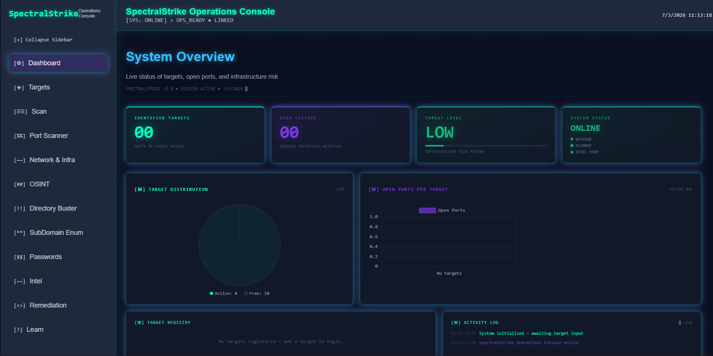
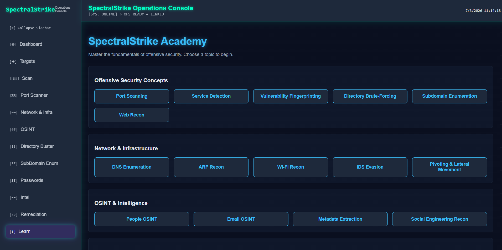
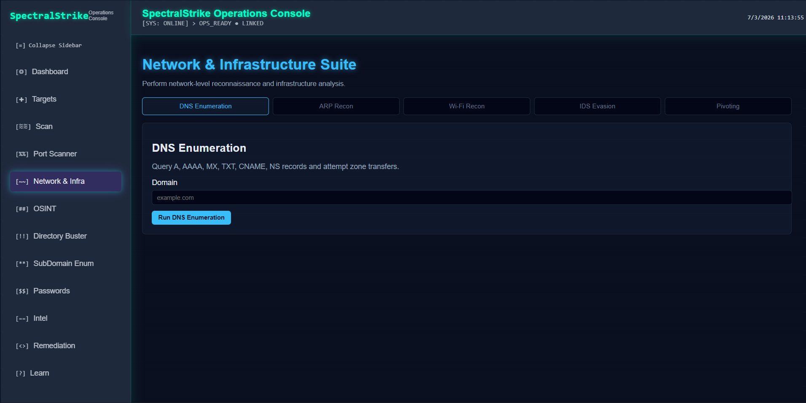
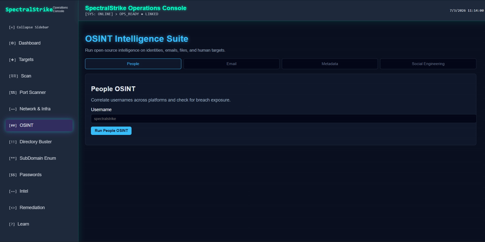
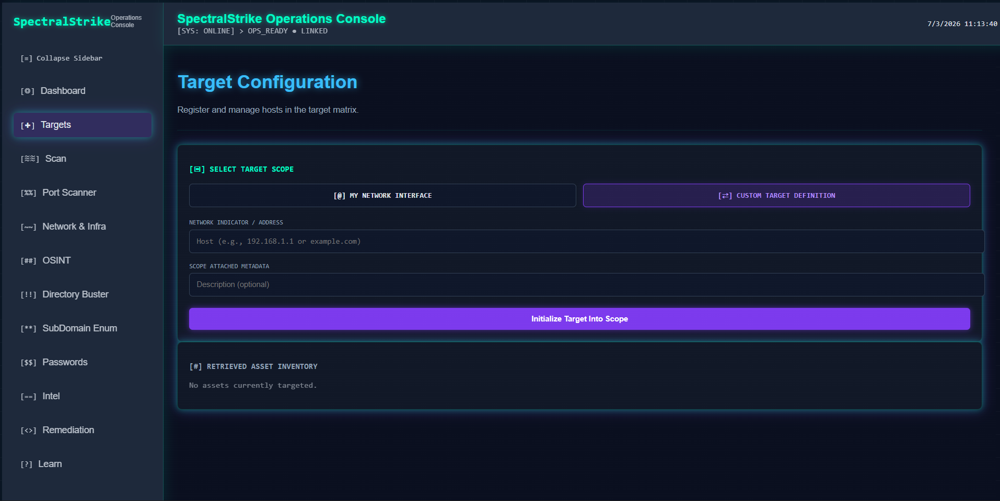

# SpectralStrike — Offensive Security Operations Console

SpectralStrike is a full‑stack offensive‑security dashboard designed for reconnaissance, OSINT, vulnerability intelligence, and infrastructure mapping.  
It is **intentionally tailored toward beginners**, offering guided workflows, simple explanations, and a clean interface that makes learning offensive security approachable without sacrificing capability.

---

## Features

### Reconnaissance
- TCP port scanning  
- Banner grabbing + service identification  
- Risk scoring engine  
- Target management (add, delete, track hosts)

### OSINT Intelligence
- Username correlation across major platforms  
- People OSINT (profile discovery)  
- Email intelligence  
- Metadata extraction  
- Social engineering modules  
- Beginner‑friendly explanations for each OSINT technique

### Web Recon
- Directory brute forcing  
- Subdomain enumeration (passive + brute force)  
- HTTP status mapping  
- Redirect tracing

### Threat Intelligence
- Live CVE feed from CIRCL  
- CVSS scoring  
- MITRE CVE links  
- Simplified summaries for newcomers

---

## Why It’s Beginner‑Friendly

SpectralStrike is built so newcomers can learn offensive security fundamentals **while actually using real tools**:

- Clear UI with guided steps  
- No overwhelming CLI flags  
- Each module explains *what* it does and *why* it matters  
- Safe defaults for scanning  
- Modular design so beginners can explore one tool at a time  

This makes SpectralStrike ideal for students, cybersecurity learners, and early red‑team practitioners.

---

## Pictures of Dashboard











---

## Tech Stack

### Backend (FastAPI)
- FastAPI  
- Uvicorn  
- httpx  
- requests  
- Custom scanning modules (ports, OSINT, recon)

### Frontend (React + Vite)
- Modular React components  
- Global scan progress system  
- Neon HUD‑style interface  
- Beginner‑friendly workflow design

---


---

## 🔧 Installation

### Backend
```bash
cd backend
pip install -r requirements.txt
python -m uvicorn main:app --reload --port 5000
```

### Frontend
```bash
cd frontend
npm install
npm run dev
```

---

## Disclaimer

SpectralStrike is an educational security tool intended for authorized testing only.
Do not scan systems you do not own or have explicit permission to test.

---

## License

SpectralStrike © 2026 by The-R34per is licensed under CC BY-SA 4.0. To view a copy of this license, visit https://creativecommons.org/licenses/by-sa/4.0/
